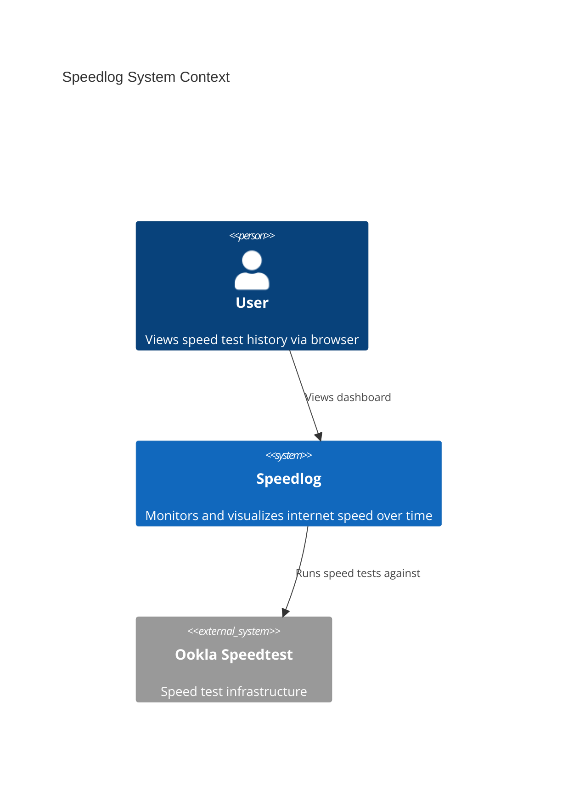
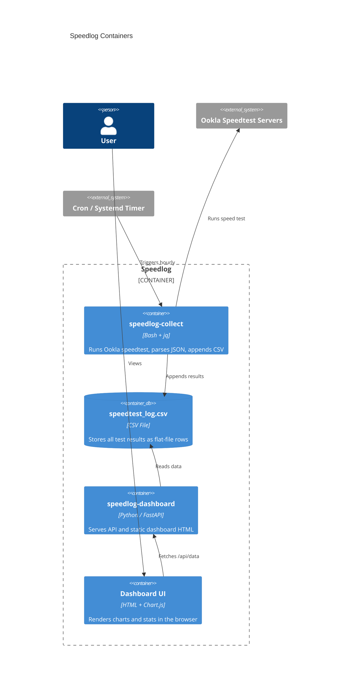
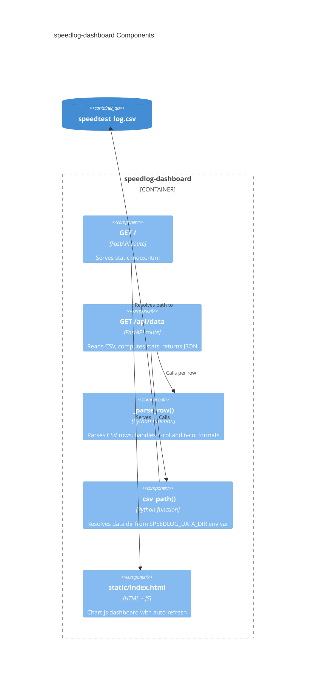

# Speedlog C4 Architecture

## Level 1: System Context

The user schedules periodic speed tests. Results are stored locally and visualized through a web dashboard.

## Level 2: Container

## Level 3: Component (Dashboard)

## Data Flow

1. **Collection**: Cron triggers `speedlog-collect` → runs `speedtest --format=json` → pipes through `jq` → appends row to CSV
2. **Dashboard**: Browser loads `/` → fetches `/api/data` → FastAPI reads CSV, computes stats (avg/min/max/latest, error rate, server distribution) → returns JSON → Chart.js renders
3. **Refresh**: Dashboard auto-refreshes every 5 minutes via `setInterval`
